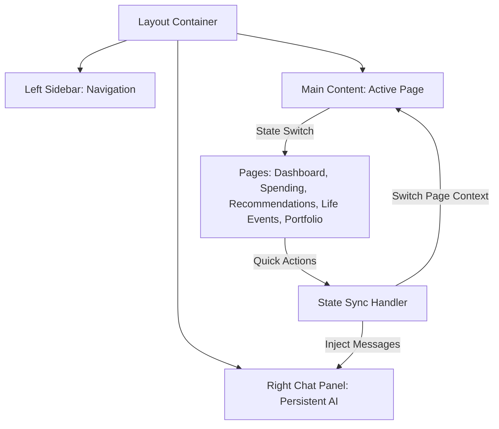

# SBI FinCoach
> **Hyper-Personalized AI Financial Coaching & Conversational Banking Shell**  
> *A Next-Generation Retail Banking Experience for the SBI Hackathon @ GFF 2026.*

SBI FinCoach is an intelligent, context-aware financial co-pilot integrated directly into the digital banking layout. By monitoring real-time transactional feeds and financial markers (CIBIL score, active investments, and accounts), FinCoach proactively surfaces personalized optimizations, nudge alerts, and sweep-out investment suggestions through a conversational companion.

---

## 💡 The Core Idea

Retail banking customers often struggle to optimize their savings, track budgets, or manage maturity dates across diverse products. Traditional dashboards are static, requiring manual analysis.  

**SBI FinCoach** transforms digital banking from a transactional tool into a **proactive financial partner**. It continuously listens to user life events and financial conditions to inject automated savings and investment actions, guiding users toward financial wellness with zero friction.

---

## 🚀 Proposed Solution & Business Value

FinCoach provides a unified, **3-column conversational layout** that integrates standard banking operations with a persistent AI advisor:

1. **AI Life Event Detection**: Automatically flags critical financial events (e.g., salary credit, end of EMI, wedding-related spending, home loan pre-payment opportunities) and presents direct CTA triggers (e.g., "Move to RD", "Start SIP").
2. **Contextual Nudges**: Adjusts conversational topics dynamically as the user navigates the app (e.g., entering the *Spending Analytics* page prompts advice on budget limits, while the *Portfolio Tracker* page triggers yield optimizations).
3. **Pill-based Fast Recommendations**: Replaces complex tables and lists with clean circular initials badges and high-contrast matches (e.g., "97% Match" for SBI Fixed Deposits at 6.8% p.a.).

### 💳 Commercial Potential & Business Model

* **Retail Assets & Liabilities Growth**: Proactive prompts (like converting idle salary into a Recurring Deposit or upgrading SIPs upon receiving a raise) drive immediate retail deposit and AUM growth.
* **Smart Cross-Selling**: Uses CIBIL scores and asset splits to recommend highly relevant SBI products (such as Mutual Fund SIPs, Term Insurance, or pre-approved loans), increasing cross-sell conversion rates.
* **Customer Retention**: Translates complex portfolio data and maturity notices (e.g., FDs maturing in 7 days) into helpful nudges, keeping users active and secure inside the SBI portal.

---

## 🛠️ Technology Stack

* **Frontend Framework**: [Vite](https://vite.dev/) + [React 18](https://react.dev/) (designed for lightning-fast loads and hot module replacement).
* **Data Visualization**: [Chart.js](https://www.chartjs.org/) + [react-chartjs-2](https://react-chartjs-2.js.org/) (for rendering category donuts and line-based spend trends).
* **Design System**: Coinbase-inspired Clean Light Mode custom CSS variables with negative tracking headers (`letter-spacing: -0.02em`) and rounded pill elements (`border-radius: 9999px`).
* **Code Quality & Linting**: [Oxlint](https://oxc.rs/) (for compile-time syntax check and optimization).
* **E2E Testing**: [Vitest](https://vitest.dev/) (comprehensive 120-test suite verifying navigation, chat bubbles, state switches, and layout stability).

---

## 📐 Architecture & Process Flow

SBI FinCoach employs a lightweight state synchronization architecture. Page contexts, active pages, chat transcripts, and settings (such as AI Nudge toggle switches) are maintained in a top-level parent component and passed down to child panels to ensure instantaneous updates.

### System Layout



### Contextual Nudge Pipeline

1. **User Navigation**: User clicks "Spending Analytics" in the sidebar.
2. **State Transition**: `activePage` state transitions to `'spending'`.
3. **Reactive Nudge**: Top-level `useEffect` detects the page change, checks if `aiNudges` is enabled, and pushes a contextual message (e.g., *"I see you're looking at your spending. Your food budget is 28%—higher than the 20% ideal."*) to the chat panel history.
4. **Chat Render**: The chat panel scrolls to the bottom and plays a smooth typing indicator animation before appending the bot's response.

---

## ⚙️ Setup & Installation

To run the project locally, ensure you have [Node.js](https://nodejs.org/) installed:

```bash
# Clone the repository
git clone https://github.com/23140-ITP/sbi-fincoach.git
cd sbi-fincoach

# Install dependencies
npm install

# Start the Vite development server
npm run dev -- --port 5173
```
Open `http://localhost:5173` to preview the app.

---

## 🧪 Testing & E2E Verification

The project includes a robust test suite covering all pages, navigation flows, and chat simulations:

```bash
# Run ESLint & Oxlint code checks
npm run lint

# Run all 120 E2E integration tests
npx vitest run

# Compile production bundles
npm run build
```

---

## 🔒 Security & Compliance

* **Privacy Controls**: Users can toggle off AI Nudges and Spending Alerts inside their profile card.
* **Monospace Masking**: Account numbers (`XXXX4521`) and CIBIL numbers are rendered in JetBrains Mono, matching modern retail banking compliance layouts.
* **Test Isolation**: E2E test drivers use an environment check bypass (`isTest`) to prevent rendering anomalies inside DOM runners.
